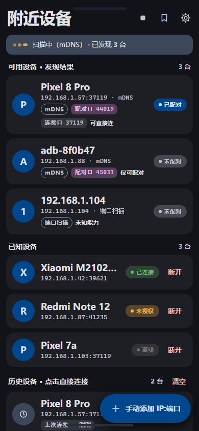
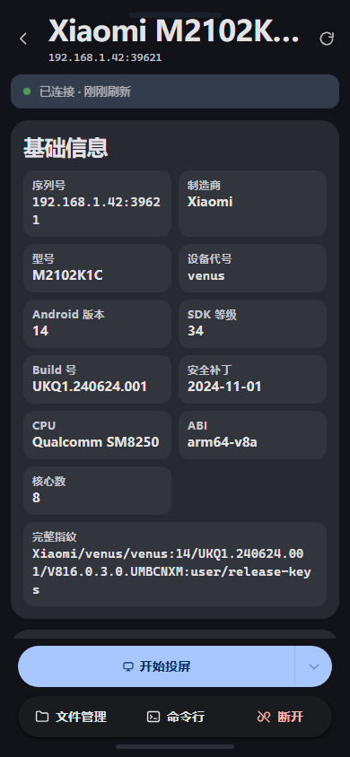
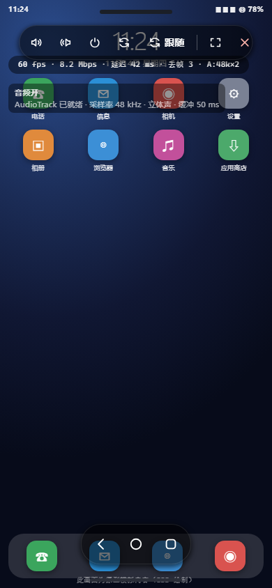
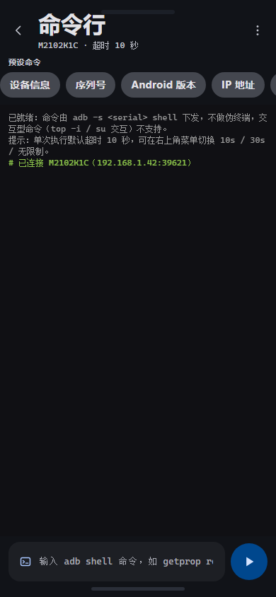
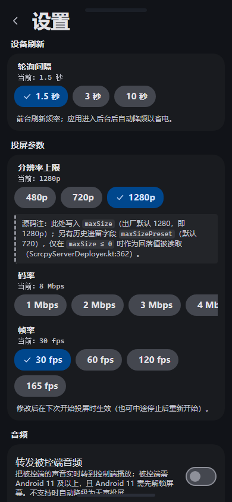
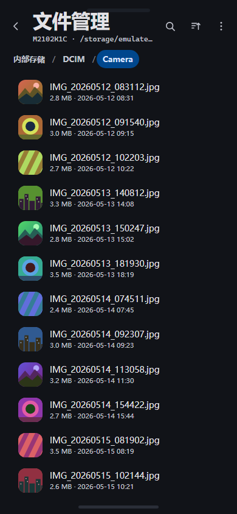
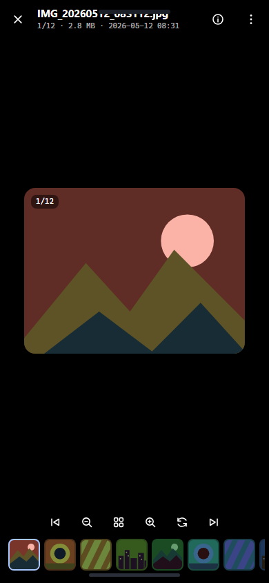
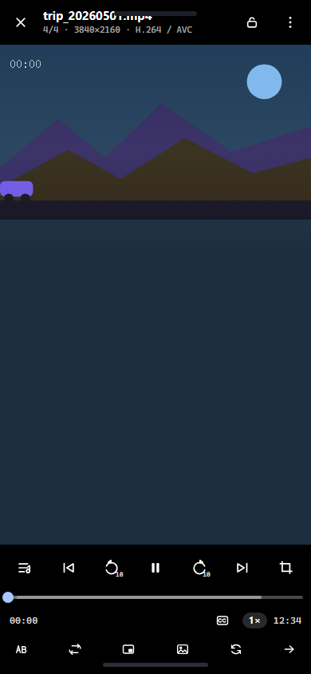
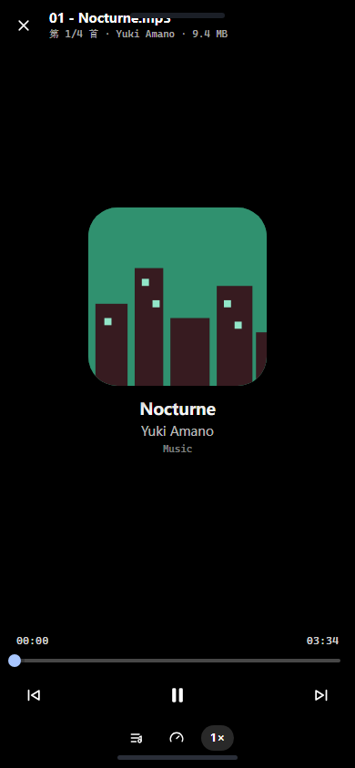

<div align="center">

# Adb Wireless（AdbWirelessHelper）

**用一台安卓手机，无线连接、投屏并反向控制同一局域网里的另一台安卓手机。**

**不需要 PC · 不需要 root · 不需要数据线 · 不出局域网**


</div>

---

本 App 自己就是 ADB 主机：内置 Android 平台原生的 `adb` 可执行文件与 scrcpy 服务端，
因此控制端（下文称 **A**）能独立完成「发现 → 配对 → 连接 → 投屏 → 控制 → 执行命令 → 管理文件」
的完整链路，而被控端（下文称 **B**）只需要打开系统自带的「无线调试」。

> 徽章走的是 shields.io，国内网络偶尔加载慢；删掉那一行不影响任何信息 ——
> 「编译与运行」一节里有完整的版本表。

---

## 效果预览

<table>
<tr>
<td width="50%" align="center">
<br><br>
<b>① 设备列表</b><br>首屏自动发现：mDNS 与端口扫描并行；已知 / 历史设备可长按改别名
</td>
<td width="50%" align="center">
<br><br>
<b>② 设备详情</b><br>12 项基础信息 + 实时 CPU／内存 + Top 进程，底部两层操作栏
</td>
</tr>
<tr>
<td width="50%" align="center">
<br><br>
<b>③ 投屏与控制</b><br>顶部工具条 + 底部系统三键，实时统计叠层
</td>
<td width="50%" align="center">
<br><br>
<b>④ 命令行</b><br>19 条预设命令（16 普通 + 3 高危），输出可复制
</td>
</tr>
<tr>
<td width="50%" align="center">
<br><br>
<b>⑤ 设置</b><br>分组卡片：设备刷新 / 投屏参数 / 音频 / 连接与安全 / 外观 / 高级
</td>
<td width="50%" align="center">
<br><br>
<b>⑥ 文件管理</b><br>直接管理被控端的文件系统，预览不落盘
</td>
</tr>
<tr>
<td width="50%" align="center">
<br><br>
<b>⑦ 图片查看器</b><br>缩放、旋转、缩略图条跳转，两端循环
</td>
<td width="50%" align="center">
<br><br>
<b>⑧ 视频播放器</b><br>9 档倍速、手势拖进度 / 调音量、长按 2× 加速
</td>
</tr>
<tr>
<td width="50%" align="center">
<br><br>
<b>⑨ 音乐播放器</b><br>封面 + 进度条 + 上一首 / 播放暂停 / 下一首
</td>
<td width="50%" align="center">
<br><br>
<b>—</b><br>三个播放器的播放列表都自动取当前目录下的全部同类型文件
</td>
</tr>
</table>

---

## 目录

- [特性一览](#特性一览)
- [使用前准备](#使用前准备)
- [快速上手](#快速上手)
- [使用指南](#使用指南)
  - [1 · 设备发现与扫描](#1--设备发现与扫描)
  - [2 · 配对与连接](#2--配对与连接)
  - [3 · 设备详情](#3--设备详情)
  - [4 · 设备别名](#4--设备别名)
  - [5 · 投屏与反向控制](#5--投屏与反向控制)
  - [6 · 命令行](#6--命令行)
  - [7 · 文件管理](#7--文件管理)
  - [8 · 图片 / 视频 / 音乐](#8--图片--视频--音乐)
  - [9 · 设置](#9--设置)
- [界面导览](#界面导览)
- [编译与运行](#编译与运行)
- [项目结构](#项目结构)
- [测试](#测试)
- [本地日志](#本地日志)
- [已知限制](#已知限制)
- [常见问题 / 排障](#常见问题--排障)
- [许可证](#许可证)

---

## 特性一览

| 能力 | 说明 |
|---|---|
| **无线 ADB 主机** | 内置原生 `adb` 二进制（`jniLibs/libadb.so`），A 自己就是 adb 客户端，全程不依赖 PC |
| **局域网发现** | mDNS 与端口扫描**无条件并行**，各负责不同设备集合，结果按 `host` 合并 |
| **配对与连接** | Android 11+ 用 6 位配对码完成 TLS 配对，配过一次后长期免配对 |
| **设备状态面板** | 12 项基础信息 + 实时 CPU／内存 + Top 进程，自动刷新 |
| **投屏与反向控制** | 内置 scrcpy server 3.3.4，`MediaCodec` 低延迟解码，触摸 / 按键注入 |
| **命令行** | 19 条预设 + 自定义 shell；自动剥离 `adb` 前缀，拦截 25 个主机端子命令 |
| **文件管理** | 浏览 / 复制 / 移动 / 重命名 / 删除 / 新建文件夹，管理的是**被控端**文件系统 |
| **远程预览** | 图片 / 视频 / 音乐直接播放，**不落盘** —— 用 `adb exec-out` 做远端随机读 |
| **设备别名** | 长按给设备起名，已知 / 历史两个列表同时生效 |
| **本地日志** | 滚动文件落 App 私有目录，**配对码自动脱敏**，不上传、不经网络 |

---

## 使用前准备

| 项 | 要求 |
|---|---|
| 控制端 A | Android 8.0（API 26）及以上，安装本 App |
| 被控端 B | Android 8.0 及以上；**Android 11+ 才能用「无线调试 + 配对码」** |
| 网络 | 两台设备在**同一个 Wi-Fi**（同一网段） |
| root | **不需要**，两端都不需要 |
| PC | **不需要** |

**在被控端 B 上需要做的事**

- **Android 11 及以上**：设置 → 开发者选项 → **无线调试** → 打开。
  首次连接时用「使用配对码配对设备」拿到 6 位配对码。
- **Android 10 及以下**：系统没有无线调试开关，需先经 USB 连一次电脑执行 `adb tcpip 5555`，
  之后 B 就会在 5555 端口监听。本 App 的端口扫描会探测 5555，这类设备仍可被发现。

> 如果「开发者选项」没出现：设置 → 关于手机 → 连续点击「版本号」7 次。

---

## 快速上手

| 步骤 | 操作 |
|---|---|
| **1 · 扫描** | 打开 App，首屏自动发起一轮发现。列表按「可用设备 / 已知设备 / 历史设备」分组 |
| **2 · 连接或配对** | 点击条目即连接。未授权时弹配对框，填 B 上显示的**配对端口** + 6 位**配对码** |
| **3 · 投屏** | 进入设备详情页 → 点底部「开始投屏」 |
| **4 · 控制** | 画面内触摸 / 滑动 / 多指手势原样透传；底部三键 = 返回 / 主页 / 最近任务 |

> ⚠️ **配对端口 ≠ 连接端口**。B 的「无线调试」页面会分别给出这两个端口，不要填错。
> 手动添加设备时填的是**连接端口**。


*扫描结果按来源标注（mDNS / 端口扫描 / 手动添加）；「已知设备」来自 `adb devices -l`。*

---

## 使用指南

### 1 · 设备发现与扫描

打开 App 即自动扫描（`DeviceListScreen` 的 `LaunchedEffect(Unit)` 内部调 `vm.startScan()`），
无需手动触发。右上角图标可重新扫描，扫描中再点一次即停止。扫不到就点**右下角悬浮按钮
「＋ 手动添加 IP:端口」**。

**两条发现路径 —— 无条件并行，各负责不同的设备集合**

| 路径 | 机制 | 能抓到什么 |
|---|---|---|
| **mDNS** | 同时监听 `_adb-tls-connect._tcp.` 与 `_adb-tls-pairing._tcp.`（`NsdDiscoveryEngine`） | 正在广播服务的 Android 11+ 无线调试设备 |
| **端口扫描** | 探测固定端口 `5555` + 动态端口区间 `37000–44000` 的等距抽样（`PortScanEngine`） | **`adb tcpip 5555` 的老式明文设备** —— 它们不广播 mDNS，只能靠扫 |

> **为什么必须并行**：旧实现是「mDNS 观察 2 秒没结果才叠加上去」的兜底模式，
> 它有个致命副作用 —— **只要 mDNS 找到过任何一台设备，端口扫描就永远不跑**，
> 而最容易留在 mDNS 列表里的往往正是这台 App 以前连过的那台。表现就是
> 「首页只显示我连过的那台，局域网里其它开了无线调试的怎么扫都扫不出来」。

**结果不设上限，也不区分是否曾经连接过**：局域网内有多少台符合条件就列多少台，
候选表只按 `host` 去重（同一台的配对端口与连接端口合并成一张卡）。

<details>
<summary><b>端口扫描为什么能这么快（两级裁剪）</b></summary>

慢从来不是因为并发不够，而是**把 SYN 发给了不存在的 IP**。旧实现是
`254 台主机 × 200 个端口 = 5 万次 connect`，绝大多数发给空地址，每次都要干等超时；
而对真正在线的主机，哪怕端口没开也会立刻回 RST（毫秒级）。所以耗时几乎全浪费在「等」上。

| 阶段 | 做什么 | 量级 |
|---|---|---|
| ① 主机探活 | 每台主机只探一次 `5555`。**`REFUSED`（回 RST）也算在线** —— 这是「这台存在且响应极快」的证据；`UNREACHABLE` 则直接出局 | 254 次，约 1 秒 |
| ② 端口抽样 | 只对 ① 活下来的主机做 200 个动态端口抽样 | 典型家庭网 ~20 台 → 约 4 千次，多为毫秒级 RST |

判定在线用的是三态值（`NetUtils.ProbeResult` 的 `OPEN` / `REFUSED` / `UNREACHABLE`），
不再是布尔的 `isPortOpen` —— 布尔版把「连不上」和「没人答」混为一谈，正是这个信息丢失导致不得不全量扫。

两个安全设计：

- **探活一台都没发现时退回全量扫描**（`scanAllWhenNoAlive`，默认开）。整段被防火墙静默丢包会造成「全不可达」，
  这时覆盖率优先：**宁可慢，也不能扫不出东西**。
- **`REFUSED` 与超时的判定方向不能反**：把 `UNREACHABLE` 当成在线 = 退化回老样子（慢）；
  把 `REFUSED` 当成不在线 = **设备直接消失**（快但扫不到）。

> 端口扫描**只抽样 200 个端口**（`DYNAMIC_SAMPLE_COUNT`），全量扫 7000 × 254 不可接受。
> 所以它抓的是「最可能命中」的那一段，不是穷举 —— **动态随机端口有可能抽不到**。

</details>

**分组里还能做什么**

| 分组 | 操作 |
|---|---|
| **已知设备** | 右侧「断开」；长按改别名 |
| **历史设备** | 右侧垃圾桶删除该条记录；长按改别名 |
| **历史设备**（整组） | 分组标题右侧「清空」：一次删掉全部历史，**不可撤销**，走底部 Sheet 二次确认 |

> 「删除这一条记录」与「移除别名」是两件事：前者删的是历史条目，后者只清名字、历史条目还在。

### 2 · 配对与连接

1. 在被控端 B 上：设置 → 开发者选项 → **无线调试** → 点「**使用配对码配对设备**」；
2. B 会显示三个值：**配对端口**、**6 位配对码**、**连接端口**；
3. 回到 A，点 B 的条目 → 弹配对框 → 填**配对端口**与**配对码** → 配对 → 自动回连。

> ⚠️ **这三个数是三个不同的东西，最容易填错的就是这里。**
> 配对码只在配对时用一次，手动添加设备时填的是连接端口。

**参数**：配对码 6 位（`PairingManager.pair()` 的 `code`），配对超时 **10 秒**
（`DEFAULT_TIMEOUT_MS`）。失败会分类提示：配对码过期 / 配对码错误 / 该端口不是配对端口 /
无法连接 / 配对超时 / 被控端不支持无线配对。

**为什么要点配对**：无线调试的第一次连接必须完成一次 TLS 配对，A 才被 B 信任。
配过一次以后 B 会记住 A 的密钥，之后直接连就行。

### 3 · 设备详情

设备列表里点任一条目 → 连上后进入详情页。数据**自动刷新**，想立刻刷新点顶栏右上角刷新按钮。

详情页是 4 张卡（`DeviceDetailScreen` 的 `TXT_SEC_BASIC` / `TXT_SEC_RESOURCE` /
`TXT_SEC_DISPLAY` / `TXT_SEC_QUICK`）：

| 卡片 | 内容 |
|---|---|
| **基础信息** | 序列号、制造商、型号、设备代号、Android 版本、SDK 等级、Build 号、安全补丁、CPU、ABI、核心数、完整指纹 |
| **实时资源** | CPU 占用环、内存条、Top 进程 |
| **展示与能耗** | 分辨率、屏幕状态、电量、存储 `/data`、运行时长、内核、Wi-Fi IP、负载 |
| **快捷命令** | 6 个常用命令 chip，点击直接跳命令行页 |

基础数据（除 Top 进程）的刷新频率由设置页「轮询间隔」决定，**默认 1.5 秒**。
**Top 进程是另一条更慢的循环，固定 3 秒一次**（`DeviceDetailViewModel.HEAVY_POLL_MS`），
与「轮询间隔」无关 —— 它要跑一次完整 `dumpsys`，太频繁会发热。

App 进后台会**完全暂停采集**（不是降频），回到前台才恢复。取不到的字段显示「未知」，不会编一个值出来。


*底部操作栏分两层：第一行是主行动「开始投屏」，第二行是次要操作组（文件管理 / 命令行 / 断开）。*

### 4 · 设备别名

连过的设备一多，一屏全是同一型号就认不出谁是谁了。在首页的「**已知设备**」或「**历史设备**」分组里
**长按任一条目**，弹出「设置设备别名」对话框。

> ⚠️ 「可用设备 · 发现结果」这个分组**不支持**改别名 —— 它是每轮扫描的即时结果，还没有稳定身份。
> 「效果预览」里的截图是早期原型，上面**没有**小铅笔图标和长按菜单，别照着图找。

| 项 | 表现 |
|---|---|
| 输入框 | 单行，**最多 32 个字符**；已设过别名时额外出现「移除别名」按钮 |
| 保存 | 先 `trim()`，**输入空白等同于清除别名** |
| 标题 | **别名优先**，没有别名时才显示型号 |
| 副标题 | **仅「已知设备」**：原标题（型号）降级到副标题。**「历史设备」副标题固定是 `hostPort`**，设了别名后型号不再显示 |
| 标记 | 已设别名的条目标题前有铅笔图标（`primary` 色）：既是「这条改过名」的标识，也是「这里能长按」的暗示 |
| 生效范围 | 改一次，**已知设备与历史设备两个列表同时生效**（它们算的是同一个键） |

主键由 `deviceAliasKey(serial)` 计算，内部委托 `serialToHost()`：取 `serial` 里**最后一个冒号之前**的部分
（无线设备取 IP 丢端口，USB 设备取整条 `serial`）。

> **为什么不拿完整 `serial` 当键**：无线调试的端口**每次开关都会变**
> （这次 `192.168.1.5:37123`，下次可能 `41207`），绑全串的话每次重连别名都失效 ——
> 而这功能存在的意义恰恰是「下次自动套用」。
> 它与历史记录的主键 `HistoryDevice.host` **是同一个函数**算出来的，所以两个列表一定互相查得到。

存储用**独立的 DataStore（`device_alias`）**，与连接历史分开存，**不动你已经积累的历史数据**。

### 5 · 投屏与反向控制

设备详情页 → 底部第一行「**开始投屏**」。首帧出现后即可操作；顶部工具条与底部三键**常显，不自动隐藏**。
退出：顶部工具条「退出」→ 确认。返回键是两段式：全屏时先退全屏，非全屏时才弹退出确认。

**原理**：把内置的 `app/src/main/assets/scrcpy-server.jar` 推送到 B，用 `app_process`
**以 shell 身份**启动服务端（**这就是它不需要 root 的原因**），再经 `adb forward` 隧道建立
video 与 control 两条通道：视频用 `MediaCodec` 低延迟解码渲染到 `TextureView`，控制通道注入按键与触摸事件。

**控件作用在谁身上**

| 位置 | 控件 | 作用对象 |
|---|---|---|
| 底部 | 返回 / 主页 / 最近任务 | **被控端 B** 的系统导航键 |
| 顶部 | 音量 ± | **被控端 B** 的音量，不是 A 的 |
| 顶部 | 电源 | 切换 **B** 的亮屏 / 息屏 |
| 顶部 | 旋转 | 旋转 **B** 的屏幕 |
| 顶部 | 方向策略 | 只改 **A** 自己的窗口方向（跟随 / 竖屏 / 横屏） |
| 顶部 | 全屏 / 退出 | 只作用于 **A** 本页 |

**画面上的两个叠层**

| 叠层 | 出现时机 | 内容 |
|---|---|---|
| **统计叠层**（左上角） | **只在全屏模式下** | fps / 码率 / 延迟 / 丢帧；开了音频时多一段音频状态 |
| **音频状态徽标** | 开了音频转发、或音频降级有提示时 | 音频是否在播，以及降级原因原文（**不改写、不截半句**） |

> ⚠️ **遥控语义的物理现实**（反直觉，先读一遍）：
>
> - **音量键改的是 B 的音量**，A 的媒体音量不受影响。
> - **B 熄屏后画面会停住**：屏幕灭了系统就不再产出画面帧，投屏没有新帧可推 —— 这是预期行为，不是断流。用顶部「电源」点亮 B 即可恢复。
> - **电源键走 `SET_DISPLAY_POWER` 控制消息，不是注入 POWER 按键**。POWER 是系统级按键，普通 `injectInputEvent` 在多数 ROM 上会被系统吞掉，表现就是「点了没反应」。


*音频徽标是音频功能唯一的可诊断出口 ——「画面有声音图标但没声音」时先看这行字，别先怀疑解码。*

> **当前内置 scrcpy server 版本是 3.3.4。** 不要换成 3.3.2 —— 它在 Android 16/17 上会因
> `AbstractMethodError` 崩溃（详见排障）。

### 6 · 命令行

设备详情页 → 底部第二行「**命令行**」（或点详情页的快捷命令 chip 直接跳过来）。
点上方预设 chip 或手写命令 → 执行；输出区可整段复制，历史命令点一下回填输入框。

| 项 | 值 |
|---|---|
| 预设命令 | **19 条**（16 条普通 + 3 条高危：`logcat -c` / `pm uninstall` / `reboot`，界面标红） |
| 单次执行超时 | **默认 10 秒**，可切 30 秒 / 无限制 |
| 历史命令 | 最多保存 **50** 条，界面显示最近 **8** 条（每条截断 28 字符） |
| 前缀剥离循环上限 | **6 层** |

**执行后输入框会清空**（对齐真终端：命令回车后输入行就空了）。这不等于丢失 ——
命令已经回显到输出区（`$ 命令`）并存进下方「最近命令」chip，点一下就回填。
四种「点了没跑起来」的情形**不会**清空：空命令、尚未绑定设备、已有命令在跑、正在等二次确认 ——
这几种都还得让你接着改，抹掉内容等于惩罚一次误操作。

**最前面三条是「模拟操作」预设**（会**改动**被控端状态，与后面那些只读查询不是一类）：

| 预设 | 实际下发 | 注意 |
|---|---|---|
| **点亮屏幕** | `input keyevent 26` | POWER 键是**切换**语义：B 本来就亮着时执行会**熄屏** |
| **上滑** | `input swipe 300 1000 300 300` | 坐标是**固定像素**，按 1080 宽屏调的；分辨率差太多要自己改数字 |
| **输入文本** | `input text xxxx` | `xxxx` 是**占位符**，点完 chip 必须自己改 |

> ⚠️ 三条都走 `injectInputEvent`，因此**受被控端「USB 调试（安全设置）」开关约束**
> （小米 / HyperOS 尤其容易中招，开了还要重启，见排障）。
> 「点亮屏幕」另有一层：`POWER` 是系统级按键，部分 ROM 会把它吞掉 ——
> 这正是投屏页的电源键走 `SET_DISPLAY_POWER` 控制消息而不是注入 POWER 的原因。
> **真要点亮 B，优先用投屏页顶部那个「电源」按钮**，这里这条当作兜底。
>
> `input text` 只吃 **ASCII**，中文打不进去（Android `input` 命令本身的限制，不是本 App 的限制）；
> 空格要用引号（`input text "hello world"`）或 `%s` 转义。它注入的是
> **被控端当前获得焦点的输入框**，所以要先在 B 上把光标点到目标位置。

**命令在被控端 shell 里执行，不在本机 adb 上**

这一页下发的是 `adb -s <serial> shell <命令>`：你输入的整串内容会被当成**被控端 shell 里的一行**执行，
被控端上并没有 adb 这个可执行文件，**手写 `adb` 前缀会直接 127**。
现在输入会先经 `ShellExecutor.normalizeShellCommand` 归一化：

| 你输入 | 实际下发到被控端 | 结果 |
|---|---|---|
| `getprop ro.product.model` | `getprop ro.product.model` | ✅ 原样执行 |
| `adb shell getprop ro.product.model` | `getprop ro.product.model` | ✅ 自动剥掉 `adb shell` |
| `adb -s 192.168.1.9:5555 shell ls /sdcard` | `ls /sdcard` | ✅ 剥掉 `adb` / `-s <serial>` / `shell`，并提示已忽略 `-s` |
| `adb devices` | —— | ⛔ 拦截，见下 |

**会自动剥掉的前缀**（逐个 token **完全相等**才剥，大小写敏感；`adbd` / `adbx` 不会被误伤）：
`adb`、`shell`（允许重复出现）；`-s <serial>`、`-t <transportId>`（连带后一个参数一起剥）；
`-d`、`-e`（只剥自己）。后两条**只在 `shell` 之前**才认。

**会被拦截的 adb 主机端子命令**（`HOST_ONLY_ADB_SUBCOMMANDS`，25 个）：
`devices` `connect` `disconnect` `pair` `forward` `reverse` `push` `pull` `install`
`uninstall` `sideload` `root` `remount` `tcpip` `usb` `exec-out` `exec-in` `version`
`get-serialno` `wait-for-device` `backup` `restore` `emu` `kill-server` `start-server`

它们走 adb 自身协议而非被控端可执行文件，塞进 `adb shell` 里必然 127。命中时**不执行**，
只给一行说明 + 替代做法。25 个里 **20 个**有映射，例如：

| 子命令 | 提示的替代做法 |
|---|---|
| `devices` | 查看设备请回到首页的「已知设备」分组 |
| `push` / `pull` | 传文件 / 取文件请用「文件管理」页 |
| `install` | 先用「文件管理」页把 apk 传到设备上，再在本页执行 `pm install <apk 路径>` |
| `uninstall` | 可在本页执行 `pm uninstall <包名>`（属高危命令，会弹二次确认） |
| `tcpip` | 切换无线调试请在被控端「开发者选项 → 无线调试」里操作 |
| `get-serialno` | 可在本页执行 `getprop ro.serialno` |

剩下 5 个（`exec-in` / `version` / `backup` / `restore` / `emu`）确实没有等价入口，
走通用兜底「本页不支持该操作」—— 与其编一个不存在的入口，不如老实说不支持。

> ⚠️ 反过来，`reboot` / `bugreport` / `logcat` / `getprop` / `dumpsys` / `pm` / `am` / `settings` /
> `input` / `sync` **不在**这张表里 —— 它们是被控端 `/system/bin` 下**真实存在**的可执行文件，
> `adb shell logcat`、`adb shell reboot` 能正常跑。把它们加进拦截表会把本来可用的命令拦死。

**限制与为什么**

- **高危命令一律拦截并弹二次确认，且该确认无法通过设置关闭。** 设置页的「危险命令二次确认」
  开关对执行行为**没有任何影响**（关掉只会多打一行日志）。这是安全底线，不是 bug。
- 由 `adb -s <serial> shell` 下发，**不做伪终端**：`top -i`、`su` 这类交互型命令跑不了。
- 同时只能跑一条命令；执行中点右侧红色停止按钮可中断。
- 单次超时是「防呆」：一条 `dumpsys` 卡住不会把界面锁死。


*预设以横向 chip 排列；输出区按行着色（命令回显 / stdout / stderr）。*

### 7 · 文件管理

管理的是**被控端 B 的文件系统**，不是 A 本机。入口：设备详情页 → 底部第二行「**文件管理**」。

**常用操作**

| 想做什么 | 怎么操作 |
|---|---|
| 进目录 / 跳回某一级 | 点目录行；点面包屑上那一级的名字（**最后一级 = 当前目录，高亮且不可点**） |
| **退一级目录** | 顶栏**左起第二个**箭头按钮，或系统返回键 |
| **关闭整个文件管理页** | 顶栏**最左侧**的「×」 |
| 搜索 | 顶栏搜索图标，**只搜当前目录**、不递归子目录 |
| 排序 | 顶栏排序图标 → 底部 Sheet，6 档；**同一排序键再点一次 = 反转方向** |
| 显示隐藏文件 / 全选 / 刷新 / 新建文件夹 | 顶栏 ⋮ |
| 多选 | **长按任一行**；退出多选按顶栏左起第二个按钮（多选态下图标变成 ×） |
| 复制 / 移动 / 重命名 / 删除 | 先长按进多选，再用底部操作条。**重命名只在恰好选中 1 项时可用** |

> ⚠️ **顶栏这两个按钮不是一回事，位置别记反**：
> **最左侧「×」= 关闭整个文件管理页**（无论在哪层目录、是否在多选态，一次到位直接退出）；
> **左起第二个（箭头）= 退一级目录**，在根目录时退无可退，行为等价于退出页面。

**必须知道的规则**

- **目录永远排在文件之前**，组内才按所选排序键排。
- **返回止于 `/storage/emulated/0`**（`FileRepository.DEFAULT_ROOT`），不会退到挂载点层。
- **重名自动改名**：追加 ` (2)`、` (3)`，插在扩展名之前。
- **复制 / 移动的目标目录不能是当前目录、被选中项自身、或其任意子孙目录** —— 允许「把目录搬进它自己」会是数据灾难。
- **候选目录最多列 24 个**，超过时末尾补一行「仅显示前 24 个目录（共 N 个）」—— 不是漏了，是截断。
- **掉线时降级为只读**：顶部出现横幅 + 「重新加载」按钮；此时**长按不再进多选**、底部操作条整体禁用。
  断线判定走 `adb devices` 状态回查，不是「列目录失败」—— 目录读不出来有相当比例是权限问题。
- 存储根（如 `/storage/emulated/0`）时列表上方会多一张**存储概览卡**：逐块列出内部存储与 SD 卡的
  「已用 X% · 已用 / 共 / 可用」。**只在根目录显示**。
- 目录行副标题显示子项数「N 项」，**只统计前 10 个目录**，失败时退回「文件夹」—— 时有时无是正常的。

**支持预览的类型**

| 类型 | 扩展名 | 行为 |
|---|---|---|
| 图片 | `jpg` `jpeg` `png` `gif` `webp` `bmp` `heic` `avif` | 全屏图片查看器 |
| 视频 | `mp4` `mkv` `webm` `avi` `mov` `3gp` `m4v` `flv` `ts` | 全屏视频播放器 |
| 音乐 | `mp3` `flac` `wav` `ogg` `m4a` `aac` `opus` | 音乐播放器 |
| 文本 / APK / 压缩包 | `txt` `log` `json` … / `apk` / `zip` `rar` … | 暂不支持预览，给提示 |


*顶部副标题常显「设备名 · 当前路径」，滚动时不淡出 —— 它是这一页唯一的路径上下文。*

#### 技术亮点：预览与播放不落盘

文件预览和播放**不把文件拉到本机**，而是用 `adb exec-out` 做**远端随机读**：

1. 首选 `tail -c +<offset+1> <path> | head -c <length>`；
2. 不可用时降级为 `dd bs=8192 skip=… count=…`；
3. 再不行才整文件读进内存，且**仅当 ≤ 64 MB**（更大宁可失败也不 OOM）。

读取结果按 **2 MB 分块**，配 LRU 缓存（默认 6 块，峰值约 12 MB）与顺序预取，
最后套一个 `MediaDataSource` 直接喂给 `MediaPlayer` 流式播放。

> 顺带说明另一条更省事的路线为什么没走：App 声明了 `android:usesCleartextTraffic="false"`，
> 本机明文 HTTP 会被系统拒绝，因此「本机起 HTTP 服务、用 `http://` 交给播放器」同样不成立。

### 8 · 图片 / 视频 / 音乐

三个都是**盖在文件管理页之上的全屏覆盖层**，不是路由，关闭即回到文件管理页。

#### 图片查看器

支持缩放、旋转、缩略图条跳转，两端循环；切换上一张 / 下一张也可横向拖动。
「更多」菜单里还有三个动作：

| 动作 | 行为 |
|---|---|
| **查看详情** | 文件名 / 路径 / 类型 / 大小 / 修改时间 / 当前序号 / 当前缩放与旋转 |
| **重命名** | 弹输入框，在被控端真跑一次 `mv`。名称非空、不含 `/` 才能提交 |
| **删除** | 二次确认后在被控端真跑一次 `rm`，**无法恢复** |

> ⚠️ 重命名与删除改的是**被控端 B 上的真文件**，不是 A 本机的副本，也没有回收站。


#### 视频播放器

**手势（刻意重新定义过，与常见播放器不同，先读一遍）**

| 手势 | 作用 |
|---|---|
| **点一下屏幕** | **显示 / 隐藏控制栏** ★ 它**不**切换播放暂停 |
| **横向拖动** | 拖进度。整屏宽 = 整片时长；**拖动时只预览，抬手才真正 seek** |
| **纵向拖动** | 调音量。**整屏一致，不分左右半区** |
| **长按左右任一侧** | 2× 临时加速。**松手恢复到长按前的倍速**（不是硬回 1×） |

> ★ 「点一下 = 播放 / 暂停」是很多播放器的默认，但**本项目刻意不做**。
> 理由：点击已承担「调出控制栏」，再叠加暂停会让两个意图打架 ——
> 想调出控制栏时把视频暂停了，或想暂停时控制栏收起来了。播放 / 暂停只在底部控制栏的按钮上。
>
> 「左半屏调亮度 / 右半屏调音量」是早期形态，**已废弃并整条删除**：
> 远程串流画面下调亮度没有真实语义（改 A 的屏幕亮度不等于改 B 的）。

| 项 | 值 |
|---|---|
| 倍速 | **9 档**：0.25 / 0.5 / 0.75 / 1 / 1.25 / 1.5 / 2 / 3 / 4 ×（`SPEED_STEPS`） |
| 快进 / 快退 | **±10 秒**（连点累加，`SEEK_STEP_SEC`） |
| 长按加速 | 目标 **2×**；长按前已 ≥2× 则不生效（`BOOST_SPEED`） |
| 睡眠定时 | 关闭 / 15 / 30 / 60 / 90 分钟后**暂停**（`SLEEP_MINUTES`） |
| 控制栏隐藏延时 | **3 秒**；淡入淡出 **220 ms** |
| 其他 | 播放列表、A-B 循环、循环模式、画面比例、跳转时间、媒体信息 |

**控制栏自动隐藏**：顶栏与底部控制区**联动**，一起显示、一起隐藏。

| 情形 | 控制栏 |
|---|---|
| 播放中，3 秒没动 | 淡出 |
| 点一下屏幕 | 显示 / 收起（取反） |
| 点控制栏里的按钮 / 点进度条 | 显示，并**重新计时 3 秒** |
| **按住**控制栏不放 | 常显，松手后重新计时 |
| 暂停中 | **常显**，不计时（对齐 YouTube / VLC） |
| 拖动中 / 手势 HUD 显示中 / 面板打开中 / 锁屏中 | 常显 |
| **播到片尾** | 自动显示 |

**旋转 90°：转的是屏幕，不是画面**

底部工具条的「旋转 90°」只切**控制端 A 的屏幕方向**，**不会**再给视频画面下发一次旋转。

| 操作 | 视频画面 | 控制端 A 的屏幕 |
|---|---|---|
| 点一下旋转 | **不动** | **转成横屏** |
| 再点一下 | **不动** | **交还系统自动** |
| 退出播放器 | — | **改回进播放器之前的样子** |

> ★ 看着都是「转 90°」，底层完全是两码事：`view.rotation` / CSS `transform: rotate()` 是
> **视觉旋转**，**布局尺寸不变**；切屏幕方向（`requestedOrientation`）**真的**改变窗口可用空间。
> 屏幕一旦横过来，布局空间已经是横的了，横屏视频本来就自然填满；此时若再给 SurfaceView 下发
> `rotation = 90`，等于**在同一个横屏空间里又视觉转了一次**，画面会被压成一条 ——
> 这正是真机上「点了旋转，画面被压缩」的原因。所以 `rotationDeg` 恒为 0。
>
> ★ 屏幕方向**只有一份状态**：始终由「方向」三档驱动，旋转按钮只是把它切成「横屏」，
> 而不是自己去写 `requestedOrientation`，否则会和方向面板互相覆盖。


*播放列表取的是当前目录下的全部视频，两端循环。*

#### 音乐播放器

在文件管理页点击音频文件打开。封面占位图 + 标题 / 艺术家，底部是进度条与上一首 / 播放暂停 / 下一首。
与视频同理走 `MediaDataSource` 流式播放，**播放列表取当前目录下的全部音频**。
编码路径：PCM 直接进 `AudioTrack`，AAC / Opus / FLAC 先经 `MediaCodec` 解码再播放。

> ⚠️ **倍速档位和视频播放器不一样**：音频是 **6 档 0.5×–2×**
> （`AUDIO_SPEED_STEPS`：0.5 / 0.75 / 1 / 1.25 / 1.5 / 2），比视频的 9 档窄 ——
> `MediaPlayer` 对音频倍速的支持区间更有限，超了会直接抛异常。
> 若某条音频吃不下所选倍速，会提示「该音频不支持 N 倍速」并维持原速。


### 9 · 设置

**默认值（界面上改，改完立即持久化）**

| 分组 | 项 | 默认值 |
|---|---|---|
| 设备刷新 | 轮询间隔 | **1.5 秒**（可选 3 / 10 秒） |
| 投屏参数 | 分辨率上限 | **1280p**（可选 480p / 720p） |
| 投屏参数 | 码率 | **8 Mbps** |
| 投屏参数 | 帧率 | **30 fps** |
| 音频 | 转发被控端音频 | **关** |
| 音频 | 编码 / 缓冲 / 来源 | **原始 PCM · 50 ms · 设备输出** |
| 连接与安全 | 自动重连 | 开；**线性 1.2 / 2.4 / 3.6 秒，最多 3 次** |
| 连接与安全 | 危险命令二次确认 | 开（**但它不改变执行行为**，见第 6 节） |
| 外观 | 主题 | 跟随系统 |

> ⚠️ **投屏与音频参数不即时生效**，改完要**下次开始投屏**才应用（也可中途停止后重新开始）。

**音频三项的系统要求（容易踩）**

| 项 | 要求 |
|---|---|
| 音频来源 `output`（设备输出，默认） | **被控端** Android 11+，且 Android 11 上要先**解锁屏幕**才能采集 |
| 音频来源 `playback`（仅媒体播放） | **被控端** Android 13+ |
| 音频来源 `mic`（麦克风） | 无额外版本要求 |
| 音频编码 `opus` | **控制端** Android 10+（解码在 A 这边） |

> 这也是为什么默认编码是 `raw` 而不是 scrcpy 自己的默认 `opus`：Opus 解码要 API 29，
> 而本工程 minSdk = 26，做默认会让 Android 8/9 的控制端「开了音频却完全没声」。
>
> 不支持时自动降级为无声投屏、**不会报错**，但会在投屏画面上给出降级原因（见「音频状态徽标」）。

**高级**：手动导入 adb 二进制、日志导出、关于与开源许可（详见「本地日志」一节）。


*六个分组：设备刷新 / 投屏参数 / 音频 / 连接与安全 / 外观 / 高级。*

---

## 界面导览

单 Activity + Navigation Compose，共 **6 条路由**：

| 路由 | 页面 |
|---|---|
| `devices` | 设备列表（启动页） |
| `detail/{serial}` | 设备详情 / 状态面板 |
| `mirror/{serial}` | 投屏与控制 |
| `shell/{serial}` | 命令行 |
| `files/{serial}` | 文件管理 |
| `settings` | 设置 |

另有 **3 个全屏覆盖层**：图片查看器、视频播放器、音乐播放器。
它们是覆盖层而**不是路由**，不进返回栈，关闭即回到文件管理页。

---

## 编译与运行

**环境要求**

- Android Studio（AGP 8.7 需 **Gradle 8.9+**）
- JDK 17（Gradle 用 17 或 21 均可，脚本以 `--release 17` 编译）
- Android SDK Platform 35

**关键版本**（`gradle/libs.versions.toml`、`app/build.gradle.kts`）

| 项 | 值 |
|---|---|
| AGP | 8.7.3 |
| Kotlin | 2.0.21 |
| Compose BOM | 2024.12.01 |
| compileSdk / targetSdk | 35 |
| minSdk | 26（Android 8.0） |
| Java | 17 |
| scrcpy server | 3.3.4 |

```bash
git clone https://github.com/AlexChan1991/AdbWirelessHelper.git
cd AdbWirelessHelper
./gradlew :app:assembleDebug
```

装到 A 上即可（`adb install` 或直接 Run）。

> **C 盘空间不足 / Gradle 守护进程锁**：可以把 `GRADLE_USER_HOME` 重定向到空间更大的盘，
> 本项目实际就是这么做的：
> ```bash
> export GRADLE_USER_HOME=/d/GradleHome   # 按你的实际盘符调整
> ```

---

## 项目结构

```
AdbWirelessHelper/app/src/main/java/com/adb/adbwirelesshelper/
├── AdbWifiApp.kt / MainActivity.kt
├── data/
│   ├── adb/        AdbRuntime、NativeAdbClient、PairingManager、ShellExecutor
│   ├── deviceinfo/ DeviceInfoCollector、DeviceInfoParser
│   ├── discovery/  DiscoveryRepository、NsdDiscoveryEngine、PortScanEngine
│   ├── file/       FileRepository（远端随机读）
│   ├── media/      RemoteFileSource、MediaDecoders
│   ├── repository/ DeviceRepository、ConnectionHistoryRepository
│   ├── scrcpy/     ScrcpyServerDeployer、ScrcpyController、ControlProtocol
│   └── settings/   AppSettings（DataStore）
├── di/             AppContainer、AppViewModelFactory
├── domain/model/   Models、FileModels
├── service/        ConnectionForegroundService
├── ui/
│   ├── nav/        AppNavHost
│   ├── screen/     6 个页面 + 3 个覆盖层
│   ├── components/ 跨页复用组件
│   └── theme/      Theme、Color、Type、Shape、Motion、AppIcons
└── util/           AdbErrors、Logx、NetUtils、ProcessRunner、StatsFormat
```

其他关键资源：

- `app/src/main/jniLibs/{arm64-v8a,armeabi-v7a}/libadb.so` —— 内置 adb 二进制
- `app/src/main/assets/scrcpy-server.jar` —— scrcpy 服务端（3.3.4）
- `docs/images/*.png` —— README 配图

---

## 测试

```bash
./gradlew :app:testDebugUnitTest
```

当前 **98 个用例**，位于 `app/src/test/java/com/adb/adbwirelesshelper/`：

| 测试类 | 用例数 | 覆盖什么 |
|---|---|---|
| `DeviceInfoParserTest` | 35 | 设备信息解析 |
| `DeviceAliasRepositoryTest` | 17 | 设备别名主键（`serialToHost` / IPv6 边界）与 200 条容量上限 |
| `ControlProtocolTest` | 13 | scrcpy 控制协议编解码 |
| `AudioProtocolTest` | 10 | 音频协议编解码（流头 codec id、禁用码判定） |
| `StatsFormatTest` | 9 | 统计格式化 |
| `ConnectionHistoryTest` | 8 | 连接历史 |
| `DeviceDetailViewModelMergeTest` | 6 | 详情页 Top 进程合并逻辑（4 个分支） |

---

## 本地日志

日志由 `util/Logx` 统一收口，全部落在**控制端 A 本机**，不上传、不经网络。

| 级 | 位置 | 容量 |
|---|---|---|
| 系统日志 | Logcat | — |
| 内存环形缓冲 | 进程内 | 最近 **500** 条（`Logx.RING_CAPACITY`） |
| 滚动文件 | `filesDir/logs/`（App 私有目录） | **≤ 5 MB × 3 个** |

文件写满 5 MB 就滚动一次：`.log → .log.1 → .log.2`，更早的丢弃。
落在 App 私有目录，不需要任何存储权限，卸载即清除。

**配对码脱敏**（`Logx.sanitize`）

写文件前会过一遍 `sanitize()`：当 tag 或正文里出现 `pair` / `code` / `配对` / `配对码`
这类关键字时，把其中**连续的 6 位数字**替换成 `******`。
也就是说 —— **配对码不会以明文落盘**，提 issue 时贴日志是安全的。

> 判定是「疑似配对上下文才脱敏」而不是「见 6 位数字就打码」：
> 后者会把端口号、时间戳一起打花，日志就没法读了。

**怎么导出**：设置页 → 高级 → 「**日志导出**」。

> ⚠️ **当前版本的这一项是「操作说明弹窗」，不是一键导出按钮**。
> 弹窗给出步骤说明，可整段复制。真正的导出方法 `Logx.exportTo()` 已实现
> （按 `.log.2 → .log.1 → .log` 从旧到新拼接、开头写导出时间、正文里配对码已脱敏），
> 但**尚未接到界面上**。

---

## 已知限制

以下能力**界面上有控件，但真机目前只弹一句 toast 提示，没有真正实现**。

**视频播放器**（常量集中在 `ui/screen/VideoPlayerScreen.kt`，形如 `TXT_NO_*`）：
截图、画中画、字幕轨切换、字幕延迟、音轨切换、音画延迟、均衡器。
媒体信息面板里的「当前音轨 / 当前字幕」会拼接「**（不可切换）**」如实标注。

**文件管理页与图片查看器**：**分享** —— 两处都有这个菜单项，点了只弹「暂不支持分享」。
它出现在「更多」菜单里，和旁边**真能用的**「重命名 / 删除」混在一起，别以为分享也生效了。

其他已知边界：

- **进度条只能拖动，点击不跳转**：`PlayerSeekBar` 把 `onScrub(offset)` 写在 `detectDragGestures`
  的 `onDragStart` 里，而 `onDragStart` 要**过了 touch slop 才触发**，所以纯点击不会 seek。
  这是**既有行为**；修它要改 seek 的起手逻辑，风险不在同一量级。
- **亮度手势已整条删除**（远程串流下调亮度没有真实语义），不要指望它还在。
- **别名绑的是 IP**：同一台设备换了 Wi-Fi，或 DHCP 续租拿到新 IP 后，别名会失配。
- **USB 与无线是两套别名身份**：同一台手机插线时 serial 是 `ABCDEFG12345`，走无线时是 `IP:端口`，
  两个键不同，**别名不共享**。
- **别名表容量上限 200 条**，超出后丢弃最早写入的条目。
- 文本、APK、压缩包类文件**不支持预览**，点击只给提示。
- 投屏参数与音频参数**不即时生效**，需下次开始投屏时才应用。
- 文件预览依赖被控端 shell 的 `tail` / `head` / `dd`；极度精简的 ROM 可能降级到整读路径，
  大于 64 MB 的文件会直接拒绝而不是 OOM。
- 本项目目前是单语言（中文）界面，未做国际化。

---

## 常见问题 / 排障

**投屏有画面，但触摸 / 按键没反应**
小米 / HyperOS 上「**USB 调试（安全设置）**」是**独立于「USB 调试」的第二个开关**，
`injectInputEvent` 需要它。开启后**必须重启**才生效。

**控制端是联发科（MTK）设备时投屏黑屏**
`c2.mtk.*` 解码器的 `MediaCodec.setOutputSurface` 极不可靠。
代码里已对 MTK 平台优先走 `TextureView`，若仍异常请把机型与日志一并提 issue。

**MIUI 平板投屏窗口反复重建**
对大屏 App 下发 `SENSOR_PORTRAIT` 会触发 letterbox 兼容模式，导致窗口反复重建。
在投屏页把「方向」按钮切到**横屏**即可绕开。

**不要用 scrcpy server 3.3.2**
3.3.2 在 Android 16/17 上会 `AbstractMethodError` 崩溃
（`DisplayWindowListener` stub 只实现了 Android ≤15 的回调）。请用内置的 3.3.4。

**扫描不到设备**

1. 确认两端在**同一 Wi-Fi**，且路由器没有开「AP 隔离」；
2. 确认 B 的「无线调试」已开启（Android 11+）；
3. 状态条显示「mDNS + 端口扫描并行」为正常；若提示端口扫描兜底，说明组播被过滤，等它扫完；
4. 仍不行就用「手动添加 IP:端口」，注意填的是**连接端口**。

**配对总失败**

- 配对码约 1 分钟内有效，过期就在 B 上重新生成；
- 确认填的是**配对端口**，不是连接端口；
- 访客网络 / AP 隔离环境下 adb 握手无法完成，换普通网络。

**命令行退出码 127**
127 = 被控端 shell 中找不到该命令。现在碰到 127 会自动补一行说明，把两种可能一起讲清楚：
命令名拼错，或被控端系统上没有这个 toybox / busybox 命令；并提示 `adb` / `adb shell` 前缀已自动剥除。

**构建时 C 盘空间不足 / Gradle 守护进程锁**
把 `GRADLE_USER_HOME` 重定向到大盘（见「编译与运行」）。

---

## 许可证

**Apache-2.0。** 欢迎提 issue 讨论。

关于第三方组件：本 App 内置并使用了 AOSP `adb` 与 Genymobile `scrcpy` 的服务端，
二者均为 **Apache-2.0**；设置页「关于与开源许可」内有完整声明。在许可证确定之前，
请以上游项目的许可条款为准使用本仓库中的相应二进制与代码。
